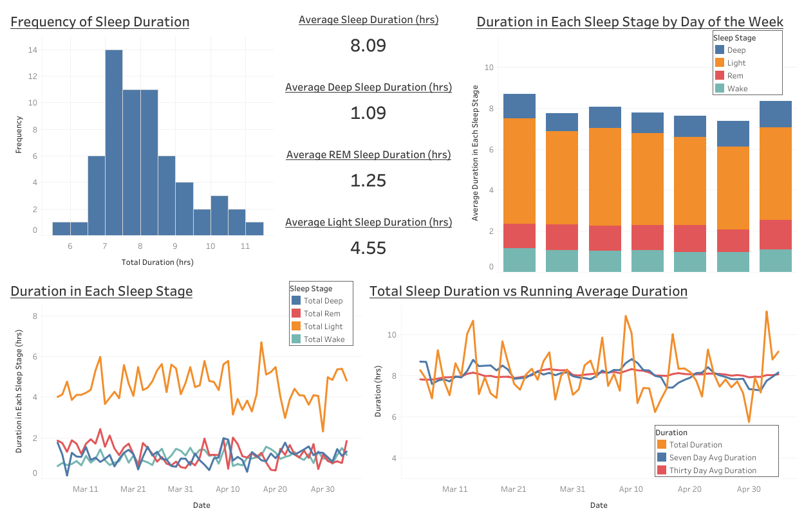

# fitbit_DE_project
Practicing data engineering skills using data pulled from FitBit's API

## Skills Demonstrated
- Pulling data from an API
- Parsing JSON files
- Pushing data to a Postgres database
- SQL queries
  - Creating tables
  - Group by
  - Order by
  - CTE
  - Window functions
- Tableau dashboard creation 

## Files
The python file holds all of the code for pulling the data from Fitbit's API, parsing the JSON file and creating a data frame, and pushing the data to Postgres. 
The SQL file hold the sql queries used in this project,  
The images holds the following image of the dashboard. The interactive version can be found at my *[Tableau Public page.](https://public.tableau.com/app/profile/sarah4232/viz/Fitbit_API_dashboard/Dashboard1?publish=yes)*

